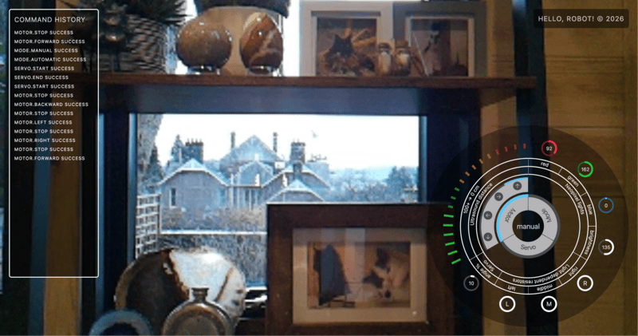

# hello_robot

A simple Raspberry Pi-based robot control system written in Rust, with a lightweight web interface for manual control.




The kit can be found [here](https://www.aliexpress.com/p/tesla-landing/index.html?UTABTest=aliabtest128998_32160&src=bing&albch=shopping&acnt=135105396&albcp=555690814&albag=1304022061862648&slnk=&trgt=pla-2333301113533049&plac=&crea=81501442626688&netw=s&device=c&mtctp=e&utm_source=Bing&utm_medium=shopping&utm_campaign=PA_Bing_%20GB_PMAX_9_MAXV__AESupply_26.1.23_hylt_1004266343&utm_content=AssetGroup_102125_153753&utm_term=Adeept%204WD%20Smart%20Robot%20Kit&msclkid=1ec982150c9413f981fdeb9da447c8bd&aff_fcid=11a13a589b4648c1abf47553a9a1844a-1770563799480-09519-UneMJZVf&aff_fsk=UneMJZVf&aff_platform=aaf&sk=UneMJZVf&aff_trace_key=11a13a589b4648c1abf47553a9a1844a-1770563799480-09519-UneMJZVf&terminal_id=4274b293fbe04386a62969acb4466e0d&scenario=c_ppc_item_bridge&productId=1005009982011552&_immersiveMode=true&withMainCard=true&OLP=1123114608_f_group1&o_s_id=1123114608).

This repo contains:

- Rust code driving motors, servos, LEDs, and basic sensors
- A web interface for controlling the robot and observing status
- Static assets and templates for the web UI

_It is a learning project, meant to explore hardware control and UI design in Rust._

What this actually does

- Drives motors and servos via GPIO
- Reads ultrasound and ldr sensors
- Controls RGB LEDs
- Serves a browser UI to control the robot in real time
- Runs entirely on a Raspberry Pi

## Requirements

- The [kit](https://www.aliexpress.com/p/tesla-landing/index.html?UTABTest=aliabtest128998_32160&src=bing&albch=shopping&acnt=135105396&albcp=555690814&albag=1304022061862648&slnk=&trgt=pla-2333301113533049&plac=&crea=81501442626688&netw=s&device=c&mtctp=e&utm_source=Bing&utm_medium=shopping&utm_campaign=PA_Bing_%20GB_PMAX_9_MAXV__AESupply_26.1.23_hylt_1004266343&utm_content=AssetGroup_102125_153753&utm_term=Adeept%204WD%20Smart%20Robot%20Kit&msclkid=1ec982150c9413f981fdeb9da447c8bd&aff_fcid=11a13a589b4648c1abf47553a9a1844a-1770563799480-09519-UneMJZVf&aff_fsk=UneMJZVf&aff_platform=aaf&sk=UneMJZVf&aff_trace_key=11a13a589b4648c1abf47553a9a1844a-1770563799480-09519-UneMJZVf&terminal_id=4274b293fbe04386a62969acb4466e0d&scenario=c_ppc_item_bridge&productId=1005009982011552&_immersiveMode=true&withMainCard=true&OLP=1123114608_f_group1&o_s_id=1123114608)
- Raspberry Pi 4 or newer
- 64-bit Raspberry Pi OS
- Rust installed on the Pi

## Setup on Raspberry Pi

1. Install Rust

Rust must be installed via rustup:

```bash
curl https://sh.rustup.rs -sSf | sh
```

Make sure ~/.cargo/bin is in your PATH.

---

2. System packages

```bash
sudo apt update
sudo apt install -y \
  libopencv-dev \
  libclang-dev \
  clang \
  pkg-config \
  libcamera-apps \
  gstreamer1.0-tools \
  gstreamer1.0-libcamera
```

**Note**: `OpenCV` is used only as a Rust-friendly interface to a GStreamer camera pipeline and for JPEG encoding — no computer vision processing is performed (yet!).

---

3. Build the project

From the repo root:

```bash
cargo build
```

This compiles the robot binary directly on the Raspberry Pi in debug mode.

---

4. Run the robot

```bash
sudo ./target/debug/hello_robot
```

This starts the robot control service and the embedded web server.
Open a browser on another device and connect to the Pi’s IP to interact with the UI.

## Web Interface

Once the robot is running:

- Visit `http://<pi-ip>:<port>` in a browser. e.g

```bash
http://raspberrypi.local:3000
```

- Use the UI to send commands to the robot
- The interface is built with Preact (no-build mode) so standard HTML/CSS/JS served from within a Rust webserver.

The static files live in the `static/` and `templates/` folders.

## Project structure

- `src/` – Rust application source code
- `static/` – Web UI assets (JS/CSS/images)
- `templates/` – HTML templates for pages
- `Cargo.toml` – Rust package config

### Robot Operating System Architecture

The core of this project is a custom robot operating system written in Rust.
Rather than using an existing robotics framework (e.g. ROS), the system is structured around a small set of explicit layers focused on clarity, testability, and real-time behaviour.

The main OS components live under src/ and are organised as follows:

```
src/
├── bus/
├── hal/
└── nodes/
```

---

`bus/` **— Event Bus & Messaging**

The `bus` module provides the _core communication mechanism_ of the robot OS.

- Defines the event types used across the system (commands, sensor updates, state changes, mode switches, etc.)
- Implements a publish/subscribe event bus
- Decouples producers (sensors, UI, behaviours) from consumers (motors, controllers, loggers)

This allows individual components to operate independently and asynchronously, while still reacting to shared system state.

This is the robot’s _nervous system_.

---

`hal/` **— Hardware Abstraction Layer**

The `hal` module is the **hardware abstraction layer**.

- Wraps low-level hardware access (motors, sensors, LEDs, camera, GPIO, I2C, etc.)
- Exposes hardware functionality via clean, Rust-friendly interfaces
- Isolates platform-specific details from the rest of the system

Nothing outside `hal` talks directly to hardware.
This keeps the higher-level logic portable and focused on behaviour rather than wiring details.

---

`nodes/` **— Robot Behaviour & Control Nodes**

The `nodes` module contains the **active runtime components** of the robot.

Each node is an independent async task responsible for a specific concern, for example:

- Motor control
- Sensor polling
- Autonomous behaviour
- Manual control
- UI command handling

Nodes communicate exclusively via the event bus and do not call each other directly.

This mirrors a robotics “node” model, but implemented deliberately and minimally rather than via a full framework.

## Design Goals

- **Explicit architecture** over magic frameworks
- **Async, event-driven design** suitable for real hardware
- Clear separation between:
  - hardware access
  - messaging
  - behaviour
- Easy to extend with new nodes, hardware, or control modes

The physical robot is intentionally simple so that the focus remains on the software architecture and control system design.

## License

MIT — see the `LICENSE` file.
